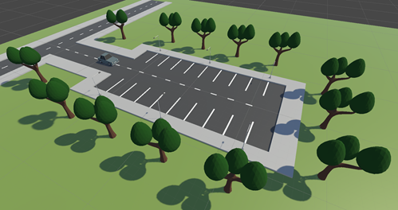

# Parking AI

### Introduction

In this project, I will try to anwser the following question: **How can a car learn to park itself in a simulated Unity environment with reinforcement learning?**

The main goal of this project is to train an agent that can successfully navigate and park in a realistic and functional parking lot environment. The environment is designed as a dead-end street, with 10 perpendicular parking spaces on each side. All of the spaces are initially occupied except for one empty space where the agent needs to park.




### Installation

#### Requirements

-   Unity
-   Anaconda

**1. Clone the repository**

```bash
git clone https://github.com/DumortierJens/Parking-AI.git
```

**2. Install Unity Hub**

Download the Unity Hub from [Unity](https://unity.com/download) and install it.

**3. Install Unity Editor**

Open Unity Hub and install Unity Editor version 2019.4.1f1 or later.

**4. Install Anaconda**

Download Anaconda from [Anaconda](https://www.anaconda.com/) and install it.

**5. Create a new conda environment**

```bash
conda create -n parking-ai python=3.8
conda activate parking-ai
```

**6. Install the requirements**

```bash
conda install pytorch torchvision torchaudio pytorch-cuda=11.7 -c pytorch -c nvidia
pip install mlagents
```

### Load the project into Unity

**1. Open Unity Hub**

**2. Add the project**

Click on the **Add** button and select the folder **Parking-AI**.

**3. Open the project**

Click on the **Parking-AI** project.

**4. Open the scene**

You can find the scene in the folder **Assets/Scenes**.

### Train the agent

**1. Build the project**

Click on **File** and then on **Build Settings**. Select your platform and click on **Build**.

**2. Edit the configuration file**

You can find the configuration files in the folder **Training/Config**. More information about the configuration files can be found in the [ML-Agents documentation](https://github.com/Unity-Technologies/ml-agents/blob/main/docs/Training-Configuration-File.md).

You can disable GAIL by commenting the parameter **gail**. Or you need to create a demonstration and edit the parameter **demo_path**.

**3. Train the agent**

```bash
conda activate parking-ai
mlagents-learn Training/Config/trainer_config_ppo.yaml --run-id=<name> --env <path to build file (.exe)> --height 180 --width 240 --quality-level 0
```

You can also add these parameters:

-   num-envs: Number of parallel environments
-   initialize-from: Path to the model to initialize the training from
-   base-port: Port to start the environment on
-   resume: Resume training from a previous run

More information about the different parameters in the [ML-Agents documentation](https://github.com/gzrjzcx/ML-agents/blob/master/docs/Training-ML-Agents.md#training-config-file).

**4. Monitor the training**

```bash
conda activate parking-ai
tensorboard --logdir=Training/Results --port=6006
```

You can open TensorBoard in your browser on [http://localhost:6006](http://localhost:6006).
